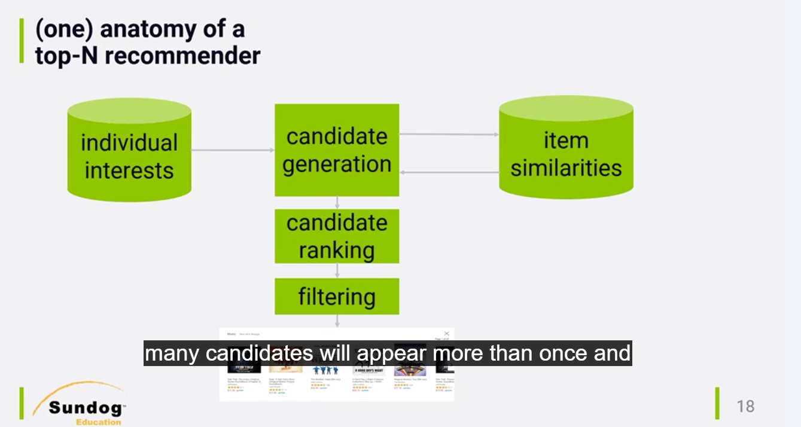
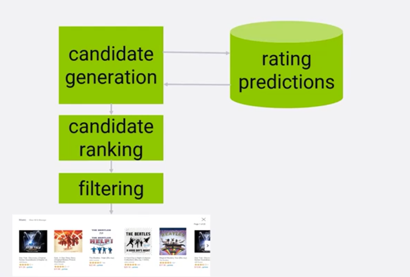

# Title

## Pre-watch questions
* How does top-n architecture look like? 

## Chunk 1
(only write concepts)

candidate
similarities
interests
filtering

## Chunk 1 converted
- the `3 main points`
- the `plain English explanation`
- `why it matters`
- `one example`

1. Recommender architecture can be boiled down to finding interests for a user
2. then findings similar items to the interests.
3. then ranking and deduping (if same items appear more times we can even increase its score)
4. finally we can do some filtering to get the topN

Another approach is to have rating predicitions for all items in catalog and then use that for candidate generation. This generally is less efficent because it goes over entire catalog and usually rating predictions do not actually generate what people will more likely be interested in.

## Chunk 1 compressed
Concept: topN architectures are generally high level generating candidates, ranking them, finally filtering them. 
Why it matters: This helps us give top N most relevant items to a user.
Example: Showing top K music based on your listening history and joining that with similar music that other people listen to. Then we rank and filter. 
One confusion: rating prediction based recommendation systems do not work too well in practice. Its better to recommend what ppl will be interested in rather than knowing what they will rate well or poorly. 
