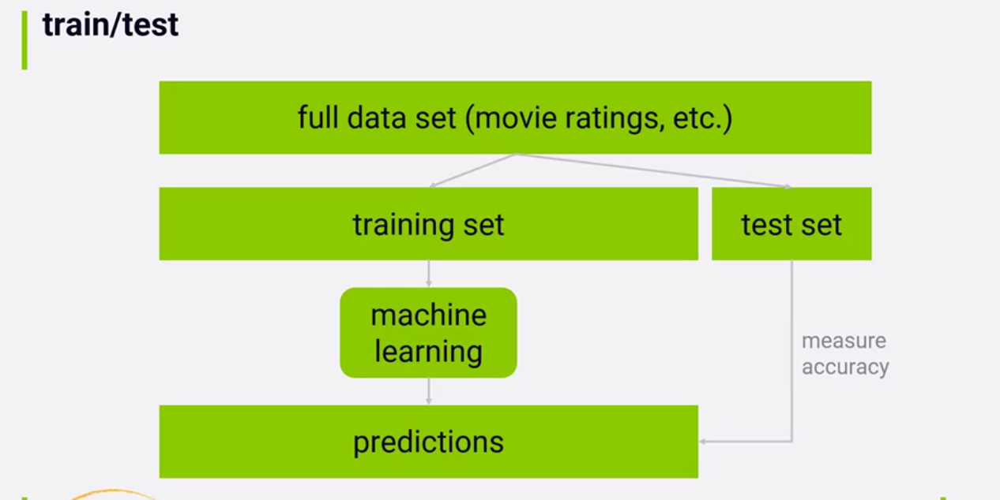
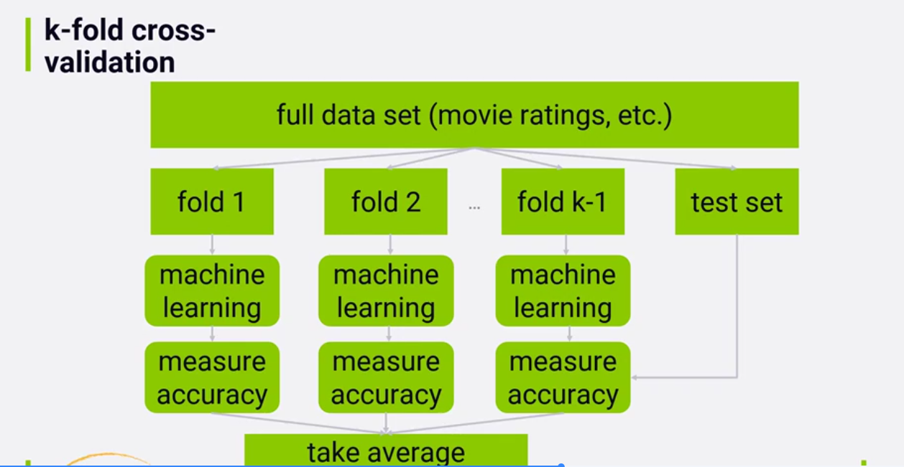

# Title

## Pre-watch questions
What does train/test and cross validation look like in recommender?
What does it mean

## Chunk 1
(only write concepts)
full set
train set
test set
predictions
k-fold cross validation
accuracy

## Chunk 1 converted
- the `3 main points`
- the `plain English explanation`
- `why it matters`
- `one example`

### 3 main points
1. the main steps in ml are splitting data. Training on training data. Measuring accuracy against test data.
2. To do this we split full set data into train set and test set where train set is usually around 90% and test is reserved for around 10%. 
3. We can avoid overfitting to train data by using k-fold cross validation, where you split training data into k folds and you train on each of those partitions and validate test against each of the k partitions. 

In ML we split full data into train and test. Train we use to train the model. Test we use to measure accuracy by quizzing the model, give it the question and do not give it the answer and see how it did.

Overfitting happens when model learns too much from training data and learns to be good against it in particular but not other general data it has not seen before. A method to combat overfitting is having larger datasets (since it usually happens with smaller data) additionally we can use k-fold cross validation to partition training into k partitions and reduce chances of overfitting.

## Chunk 1 compressed
Concept: train, test, and measure accuracy are main lifecycle of ml model
Why it matters: these are steps used to train recommender
Example: we want how user rated a title, the features are the user and the label is the rating. We split 90/10 train and test. When testing we give the model that trained on train data the user metadata (features) but do not give it the label (ratings). After the ml model makes predictions we measure the accuracy by comparing prediction with actual rating user gave. This is offline evaluation
One confusion: ...
