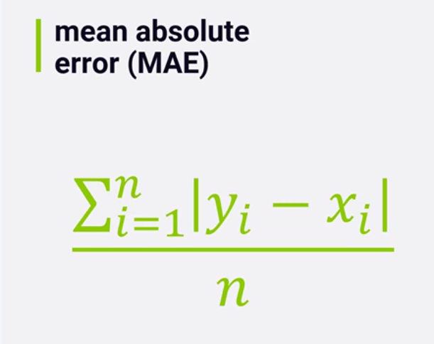
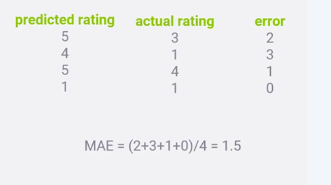
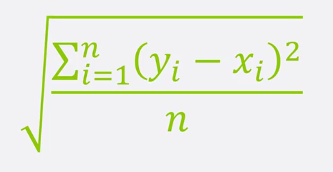
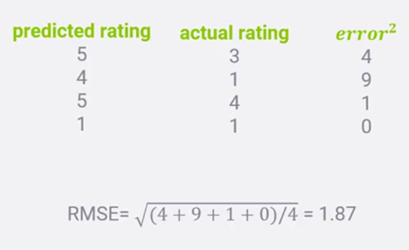

# Title

## Pre-watch questions
What is Root Mean Squared Error and Mean Absolute Error?
How are they different from each other

## Chunk 1
(only write concepts)

Mean absolute error (MAE)
Root Mean Squared Error (RMSE)

## Chunk 1 converted
- the `3 main points`
- the `plain English explanation`
- `why it matters`
- `one example`

Measuring error
1. there are two main ways ML models measure error MAE and RMSE.
2. MAE is mean average error so it takes all predictions and actual results and takes the absolute value as the error, we then average this. There is also RMSE root mean squared error. This takes the difference between prediction and actual result and squares it then takes the average of all errors and square roots it. The squaring of the errors helps penalize more when more inaccurate and penalize less when less inaccurate.
3. Recommendation system builders realized that offline evaluation of MAE and RMSE were not that important and did not really predict online performance too well. They instead need something that shows how well our recommendations do against people that have never seen those title before, this is more of an online evaluation.

RMSE is more widely used than MSE in ML models. Generally they are both offline ways to evaluate trained models with test datasets for error. The lower the better. In real life recommendaition systems they have realized these offline metrics for RMSE and MAE are not that predicive to actual performance. What they need is to see how it performons to people they have never seen before in a more online ways. They are useful for initial valuations but more metrics are needed to evaluate effectivaly

### MSE

### RMSE

## Chunk 1 compressed
Concept: MSE and RMSE are offline metrics to measure model accuracy
Why it matters: accurate models mean that their predictions correspond closely to labels
Example: we train models to predict what a user will rate a show, and we evaluate those models with shows the user has seen and the ratings they gave them, we can then test how accurate it was by comparing prediction vs the rating the user gave to measure the avg error 
One confusion: MSE and RMSE are not the end all be all. For recommender systems we need to supplement this data to reflect better how users will react to new items or recommendations that they haven'ts seen before.
