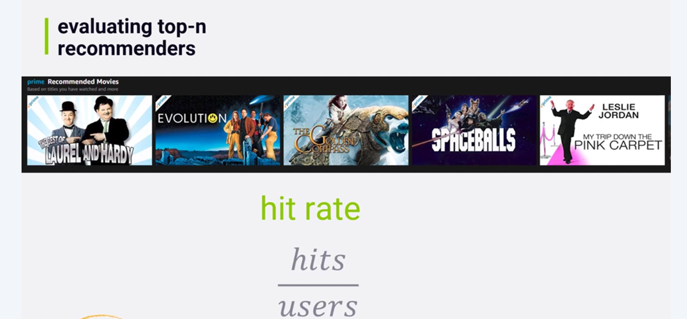
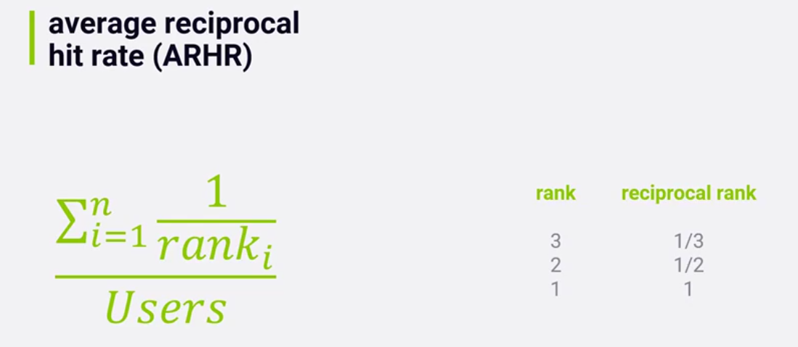
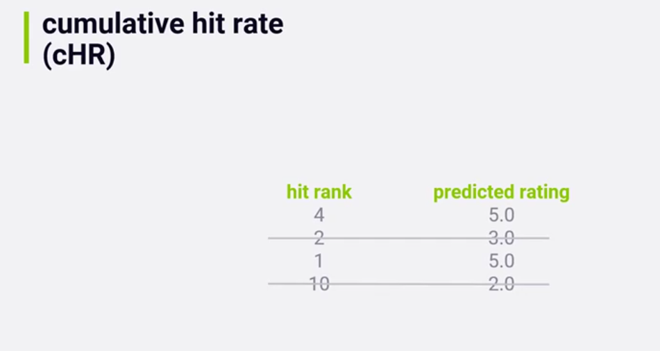
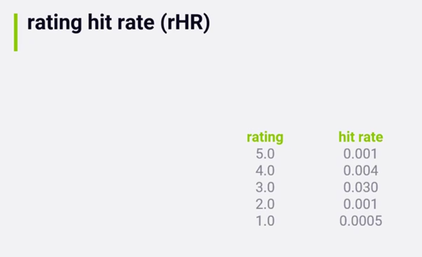

# Title

## Pre-watch questions
What is top-n hit rate?
Why is it better metter than mse and rmse?

## Chunk 1
(only write concepts)

hit rate
leave-one-out cross validation
average reciprocal hit rate (ARHR)
cummulative hit rate (cHR)
rating hit rate (rHR)

## Chunk 1 converted
- the `3 main points`
- the `plain English explanation`
- `why it matters`
- `one example`

### 3 main points
1. hit rate helps us understand from what we recommended in topK which did the user actually rated positively 
2. To do offline evaluation we cannot do normal test/train split since that is for individual ratings but rather topend lists. Instead the approach is called leave-one-out cross validation. Here we give top K that user rated and then we remove one from the result and measure if system can fill that item in. This usually results in very low hit rate because its hard to fill one item when catalog is large.
3. There are many ways to measure hit rate
 3.1. average reciprocal hit rate - which punishes putting good titles lower in the list
 3.2. cummulative hit rate - which we dont count certain predicted ratings if they do not meet a predicted threshold. So we only measure hit rate from predictions that the system actually thought you would like
 3.3. rating hit rate - partition ratings and give each of them a hit rate. For example we rated title 5/5 and those have 0.001 hit rate. 4/4 rating has 0.004 hit rate, etc. 

### hit rate

### average reciprocal hit rate

    
### cummulative hit rate

# rating hit rate (rHR)

## Chunk 1 compressed
Concept: hit rate lets us understand from our topN items which did the user actually interact with.
Why it matters: This is a more accurate measurment of performance than MAE and RMSE for recommendation systems.
Example: We gave user 5 titles and they watched 3 of them
One confusion: For offline evaluation we do leave-one out validation. instead of regular test/train split.This leaves out a rating that the user gave and then see how accurate the system is at recommending the rating that we left out from the rest of the catalog.
